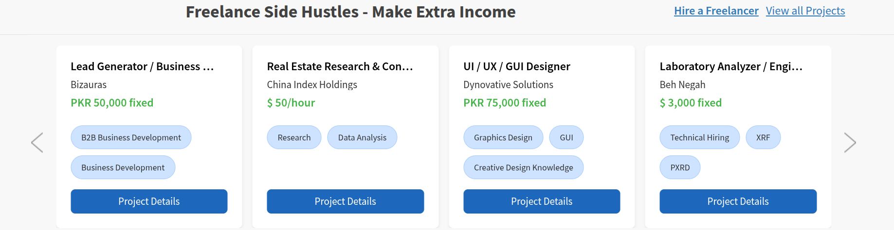
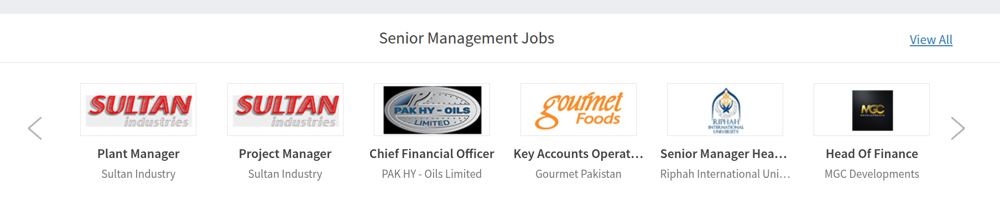
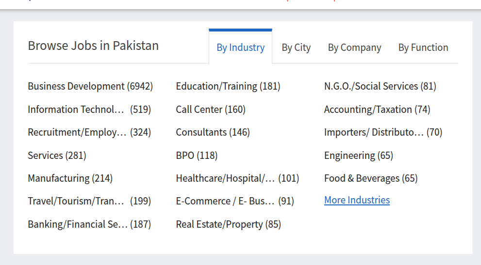
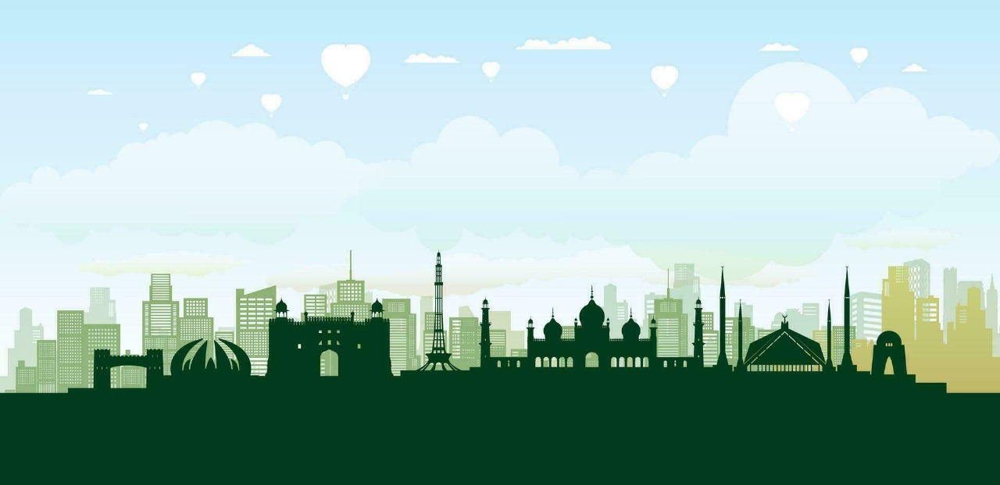

## Tasks - Phase 2

### Task-1: Category Rendering Logic

Logic to render different categories of jobs in different secitons on homepage

Cost = 4000
ETA = 3-4 days

### Task-2: Category-Wise Designs

Designs like:

||||
|-|-|-|
||||

- Depends on number of design sections
- Rs. 500 per section.

### Task-3: Footer Image Vector Design

- Create a vector for footer
- from following image

Cost = 500 (designer)
ETA = 1d

### Task-4: Icons expand with Animation.

Social media icons on bottom right should expand up with an animation from an icon.

Cost = 500
ETA = 1d

### Task-5: Post Slider Limit

If exceeds 10 posts, then add pagination slider to move to next 10.

Cost = 1500
ETA = 2-3 days.

## Summary & Total

| # | Task                        | Cost            | ETA                 |
| - | --------------------------- | --------------- | ------------------- |
| 1 | Category Rendering Logic    | 4000            | 3–4 days            |
| 2 | Category-Wise Designs       | 500 per section | Depends on sections |
| 3 | Footer Image Vector Design  | 500             | 1 day               |
| 4 | Icons Expand with Animation | 500             | 1 day               |
| 5 | Post Slider Limit           | 1500            | 2–3 days            |

Total Cost = 7,500 + (500 for each section)